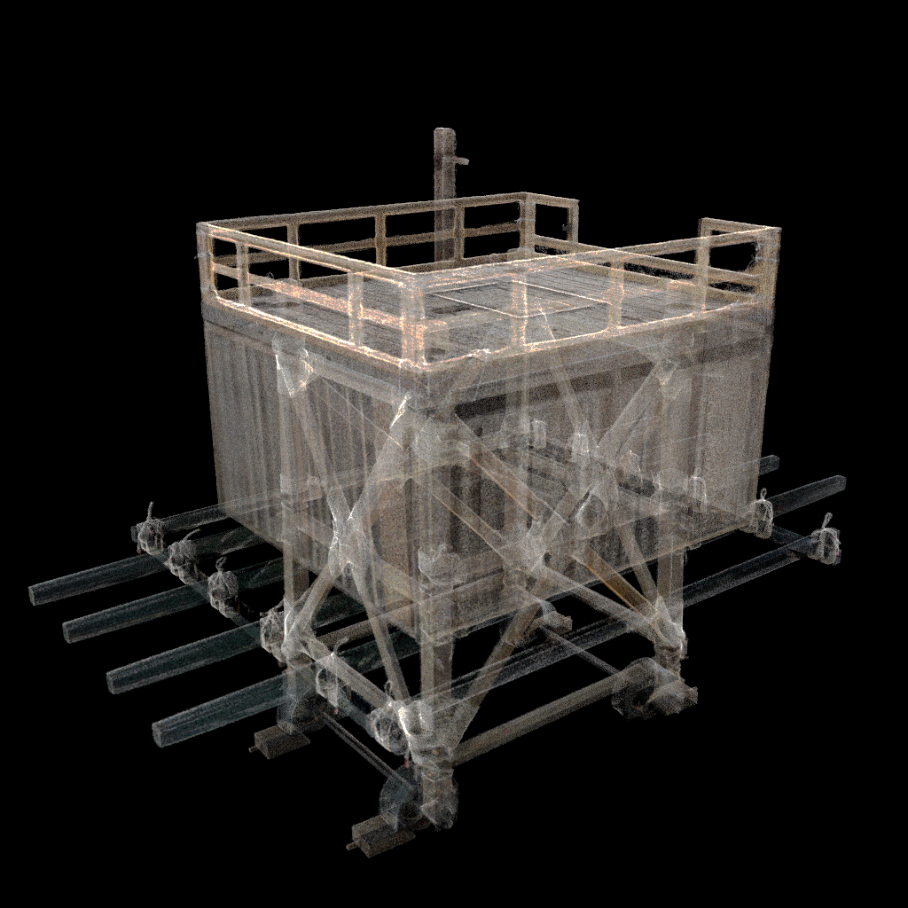
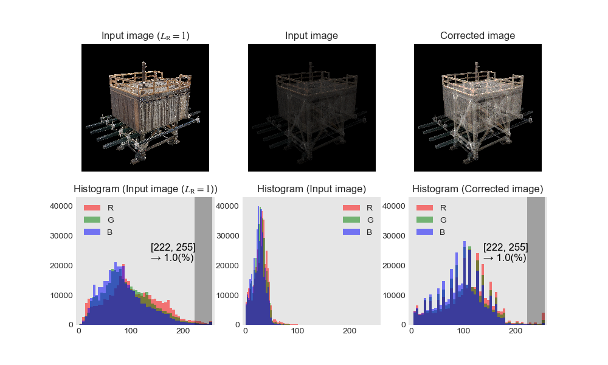

## Correct Pixel Value

### USAGE
```
$ python correct_pixel_value.py
===================================
     Correct Pixel Value
      author : Tomomasa Uchida
      date   : 2019/02/08
===================================

USAGE        : $ python correct_pixel_value.py [input_image_data] [input_image_data(LR=1)]
Example      : $ python correct_pixel_value.py [input_image.bmp] [input_image_LR1.bmp]]
```

### Example
```
$ python correct_pixel_value.py hachimanyama_LR100.bmp hachimanyama_LR1.bmp 
===================================
     Correct Pixel Value
      author : Tomomasa Uchida
      date   : 2019/02/08
===================================

Input image data (args[1])       : hachimanyama_LR100.bmp
Input image data(LR=1) (args[2]) : hachimanyama_LR1.bmp
p_init                           : 1.0
p_interval                       : 0.01


====================================
 STEP1 : Get max pixel value (LR=1)
====================================
Input image (RGB)                : (1024, 1024, 3)
N_all                            : 1048576 (pixels)
N_all_nonzero                    : 354746 (pixels)
Max pixel value (LR=1)           : 255 (pixel value)
Num. of max pixel value (LR=1)   : 537 (pixels)
Ratio of max pixel value (LR=1)  : 0.15 (%)
Most frequent pixel value (LR=1) : 80 (pixel value)


================================================
 STEP2 : Search for standard pixel value (LR=1)
================================================
Ratio of reference section       : 1.0 (%)
Standard pixel value (LR=1)      : 222 (pixel value)
Reference section                : 222 ~ 255 (pixel value)
Ratio of reference section       : 1.02 (%)


=============================
 STEP3 : Correct pixel value
=============================
p_final                          : 3.57
Ratio of num. of pixels to 255   : 0.16 (%)
```

## Image

### Input image


### Input image (LR=1)


### Corrected image


### Figure
